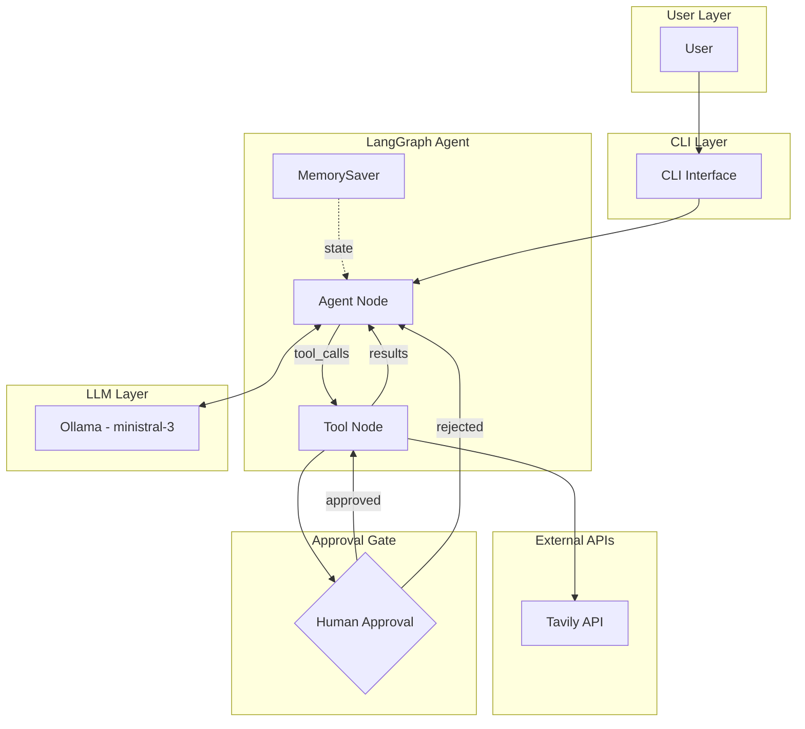
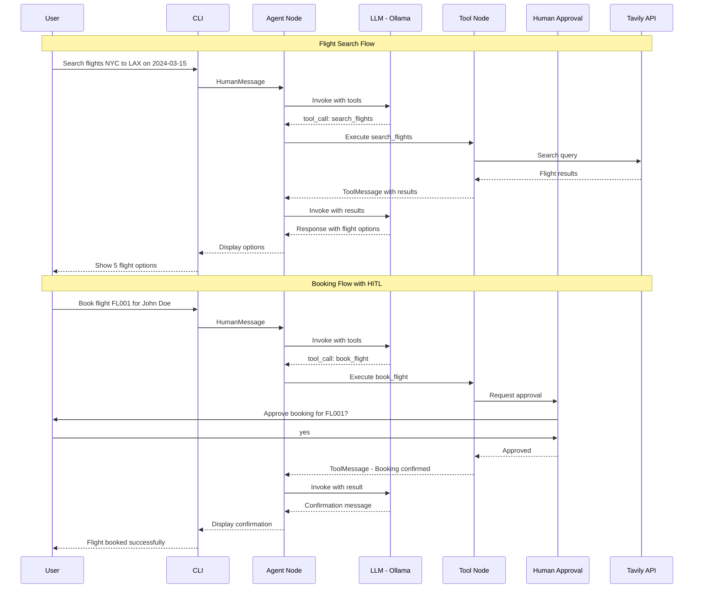

# Human-in-the-Loop Flight Booking Agent


A demonstration of building an AI agent with **explicit human approval** for sensitive actions using LangGraph. This project showcases the Human-in-the-Loop (HITL) pattern where critical operations require user confirmation before execution.

## Features

- **Flight Search** - Search for flights via Tavily API with origin, destination, and date
- **Human-in-the-Loop Approval** - Booking actions require explicit user confirmation
- **Conversation Memory** - Persistent chat history using LangGraph's MemorySaver
- **Local LLM** - Runs entirely on Ollama with ministral-3 (no cloud API required)
- **Structured Tools** - Clear parameter schemas for reliable tool execution
- **CLI Interface** - Interactive command-line interface for conversations
- **Debug Logging** - Detailed state transition and tool execution logs

## Architecture



## Sequence Diagram



## Prerequisites

- **Python 3.10+** - Required for modern type hints and LangGraph
- **Ollama** - Local LLM runtime ([Install Ollama](https://ollama.ai))
- **Tavily API Key** - For flight search functionality ([Get API Key](https://tavily.com))

### Installing Ollama and Model

```bash
# Install Ollama (macOS/Linux)
curl -fsSL https://ollama.ai/install.sh | sh

# Or download from https://ollama.ai for Windows

# Pull the required model
ollama pull ministral-3:latest

# Verify Ollama is running
ollama list
```

## Installation

1. **Clone the repository**
   ```bash
   git clone <repository-url>
   cd hitl-flight-booking-agent
   ```

2. **Create virtual environment**
   ```bash
   python -m venv venv
   
   # Windows
   venv\Scripts\activate
   
   # macOS/Linux
   source venv/bin/activate
   ```

3. **Install dependencies**
   ```bash
   pip install -r requirements.txt
   ```

4. **Configure environment variables**
   ```bash
   cp .env.example .env
   ```
   
   Edit `.env` and add your Tavily API key:
   ```
   TAVILY_API_KEY=your_actual_api_key_here
   ```

5. **Run the agent**
   ```bash
   python main.py
   ```

## Configuration

| Variable | Required | Description |
|----------|----------|-------------|
| `TAVILY_API_KEY` | Yes | API key for Tavily search service |

Get your API key at [https://tavily.com](https://tavily.com) - free tier available.

## Usage

### Starting the Agent

```bash
python main.py
```

### Example Conversation: Flight Search

```
🤖 Flight Booking POC Ready (Model: ministral-3:latest)
Type 'quit' to exit.
------------------------------

👤 You: Find me flights from New York to London on 2024-03-15

🤖 Agent: I'll search for flights from New York to London on March 15, 2024.

1. Flight Option:
   Source: https://example-flights.com/nyc-lon
   Details: Direct flights available from JFK to LHR starting at $450...

2. Flight Option:
   Source: https://another-flights.com
   Details: Connecting flights via Dublin, prices from $380...
```

### Example Conversation: Booking with Approval

```
👤 You: Book the first flight for John Smith

⚠️  ACTION REQUIRED: The agent wants to book a flight.
   Flight ID: FL001
   Passenger: John Smith
   Do you approve this booking? (yes/no): yes

🤖 Agent: Successfully booked flight FL001 for John Smith. Your booking is confirmed!
```

### Rejecting a Booking

```
👤 You: Book flight FL002 for Jane Doe

⚠️  ACTION REQUIRED: The agent wants to book a flight.
   Flight ID: FL002
   Passenger: Jane Doe
   Do you approve this booking? (yes/no): no
   ❌ Booking rejected by user.

🤖 Agent: The booking was not completed. Would you like to choose a different flight?
```

## Project Structure

```
hitl-flight-booking-agent/
├── main.py                 # Application entry point and LangGraph workflow
├── requirements.txt        # Python dependencies
├── .env.example           # Environment variable template
├── README.md              # This file
├── prompts/
│   ├── __init__.py        # Prompt exports
│   └── flight_assistant.py # System prompt for the agent
├── tools/
│   ├── __init__.py        # Tool exports
│   └── tavily_search.py   # Tavily API wrapper for flight search
└── plans/
    └── tavily-flight-search.md # Development notes
```

## How It Works

### The Human-in-the-Loop Pattern

The HITL pattern is implemented through a custom `HumanApprovalToolNode` that intercepts tool calls before execution:

```python
class HumanApprovalToolNode:
    def __call__(self, state: AgentState):
        for tool_call in last_message.tool_calls:
            if tool_name == "book_flight":
                # Approval gate - pause and ask user
                user_input = input("Approve booking? (yes/no): ")
                if user_input == "yes":
                    result = self.tools_by_name[tool_name].invoke(tool_args)
                else:
                    result = "User rejected the booking."
```

### Agent Workflow

1. **User Input** → CLI captures user message
2. **Agent Node** → LLM processes message with system prompt
3. **Tool Decision** → LLM decides whether to call tools
4. **Tool Execution** → Tools execute (with approval gate for sensitive actions)
5. **Response** → LLM generates final response
6. **Memory Update** → State saved via MemorySaver

### State Management

The agent uses `AgentState` TypedDict with message history:

```python
class AgentState(TypedDict):
    messages: Annotated[list, add_messages]
```

The `add_messages` reducer handles message accumulation and deduplication.

## API Reference

### Tools

#### `search_flights`

Search for available flights between cities.

```python
@tool
def search_flights(
    origin: str,       # Departure city or airport code (e.g., "NYC", "JFK")
    destination: str,  # Arrival city or airport code (e.g., "LON", "LHR")
    date: str          # Travel date in YYYY-MM-DD format
) -> str               # Formatted flight options
```

**Returns:** Top 5 flight options with airline, times, and prices.

#### `book_flight`

Book a specific flight (requires human approval).

```python
@tool
def book_flight(
    flight_id: str,    # Flight identifier from search results
    user_name: str     # Passenger's full name
) -> str               # Booking confirmation or rejection
```

**Note:** This tool triggers the human approval gate before execution.

> ⚠️ **Important:** This is a demonstration/POC project. The booking tool only returns a success string and does **not** perform actual payment processing or real flight reservations. No payment integration has been implemented.

### Classes

#### `TavilyFlightSearch`

Wrapper for Tavily API flight searches.

```python
class TavilyFlightSearch:
    def __init__(self, api_key: str = None)
    def search(self, origin: str, destination: str, date: str, max_results: int = 5) -> List[Dict]
```

#### `HumanApprovalToolNode`

Custom tool node with approval gate for sensitive actions.

```python
class HumanApprovalToolNode:
    def __init__(self, tools: list)
    def __call__(self, state: AgentState) -> dict
```

## Troubleshooting

### Common Issues

| Issue | Solution |
|-------|----------|
| `TAVILY_API_KEY not found` | Create `.env` file with your API key from [tavily.com](https://tavily.com) |
| `Connection refused to localhost:11434` | Start Ollama: `ollama serve` |
| `Model ministral-3 not found` | Pull the model: `ollama pull ministral-3:latest` |
| `ModuleNotFoundError: No module named 'langgraph'` | Install dependencies: `pip install -r requirements.txt` |
| Agent not responding to tool calls | Check Ollama logs: `ollama logs` |

### Debug Mode

The agent includes built-in debug logging for state transitions:

```
============================================================
📥 [AGENT NODE] State received:
   Total messages in state: 3
   [0] HumanMessage: Find flights from NYC to LAX...
   [1] AIMessage: I'll search for flights...
       └── Tool calls: [{'name': 'search_flights', 'args': {...}}]
============================================================
```

### Verifying Ollama Connection

```bash
# Check if Ollama is running
curl http://localhost:11434/api/tags

# Test model inference
ollama run ministral-3:latest "Hello, how are you?"
```

## License

This project is licensed under the MIT License - see below for details:

```
MIT License

Copyright (c) 2024

Permission is hereby granted, free of charge, to any person obtaining a copy
of this software and associated documentation files (the "Software"), to deal
in the Software without restriction, including without limitation the rights
to use, copy, modify, merge, publish, distribute, sublicense, and/or sell
copies of the Software, and to permit persons to whom the Software is
furnished to do so, subject to the following conditions:

The above copyright notice and this permission notice shall be included in all
copies or substantial portions of the Software.

THE SOFTWARE IS PROVIDED "AS IS", WITHOUT WARRANTY OF ANY KIND, EXPRESS OR
IMPLIED, INCLUDING BUT NOT LIMITED TO THE WARRANTIES OF MERCHANTABILITY,
FITNESS FOR A PARTICULAR PURPOSE AND NONINFRINGEMENT. IN NO EVENT SHALL THE
AUTHORS OR COPYRIGHT HOLDERS BE LIABLE FOR ANY CLAIM, DAMAGES OR OTHER
LIABILITY, WHETHER IN AN ACTION OF CONTRACT, TORT OR OTHERWISE, ARISING FROM,
OUT OF OR IN CONNECTION WITH THE SOFTWARE OR THE USE OR OTHER DEALINGS IN THE
SOFTWARE.
```
