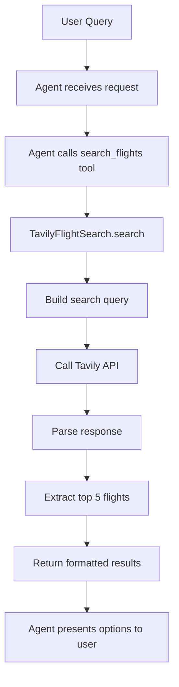

# Tavily Flight Search Implementation Plan

## Overview
Replace the hardcoded flight search with Tavily API integration to fetch real flight data. Return top 5 flights with structured parameters.

## Current State
- [`main.py`](main.py) contains a hardcoded `search_flights` tool with mock data
- Uses LangGraph with human-in-the-loop for booking approval
- Model: ChatOllama with ministral-3

## Proposed Changes

### 1. Project Structure
```
hitl-flight-booking-agent/
├── main.py                 # Main agent (updated)
├── tools/
│   └── tavily_search.py    # Tavily search service
├── .env                    # API key configuration
├── requirements.txt        # Dependencies
└── plans/                  # Documentation
```

### 2. Dependencies Update
Add to [`requirements.txt`](requirements.txt):
- `tavily-python` - Official Tavily SDK
- `python-dotenv` - Environment variable management

### 3. Tavily Search Module
Create [`tools/tavily_search.py`](tools/tavily_search.py) with:
- `TavilyFlightSearch` class for API interaction
- Structured search parameters: origin, destination, date
- Response parsing to extract top 5 flights
- Error handling for API failures

### 4. Tool Interface
Update `search_flights` tool signature:
```python
@tool
def search_flights(origin: str, destination: str, date: str) -> str:
    """
    Search for flights between origin and destination on a specific date.
    Returns top 5 flight options with airline, times, and price.
    """
```

### 5. Flight Data Structure
Each flight result will contain:
- `airline` - Airline name
- `flight_id` - Unique identifier
- `departure_time` - Departure time
- `arrival_time` - Arrival time
- `price` - Ticket price
- `source` - Data source URL

### 6. Configuration
Environment variables in `.env`:
```
TAVILY_API_KEY=your_api_key_here
```

## Implementation Flow



## Files to Modify/Create

| File | Action | Description |
|------|--------|-------------|
| `requirements.txt` | Modify | Add tavily-python, python-dotenv |
| `tools/__init__.py` | Create | Package initialization |
| `tools/tavily_search.py` | Create | Tavily search service |
| `main.py` | Modify | Update search_flights tool |
| `.env.example` | Create | Example environment file |

## Error Handling
- Missing API key: Clear error message with setup instructions
- API failure: Graceful fallback with user-friendly message
- No results: Informative response suggesting alternative searches
- Rate limiting: Retry logic with exponential backoff

## Ready for Implementation
This plan is ready for Code mode implementation. Switch to Code mode to make the actual file changes.
